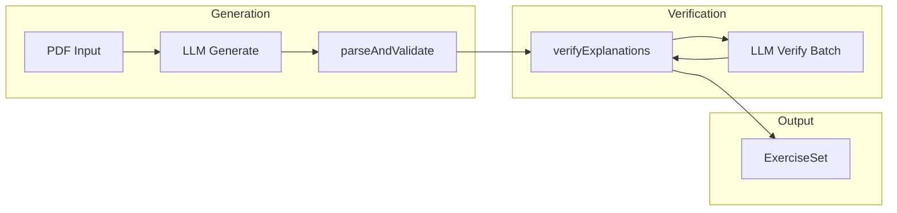

<!-- c04e8888-a1f5-4204-925f-ea32d464f491 -->
# Concept Explanations for Exercises (with Verification)

## Current State

- **Exercise generation**: `generateExercisesFromPdf` produces an `ExerciseSet` via OpenAI or Anthropic. The prompt in `src/lib/extraction/prompts.ts` defines the JSON schema.
- **Feedback flow**: After confirming, `QuestionRenderer` shows Correct/Incorrect and the correct answer. No concept explanation.
- **Data model**: `Question` has no `explanation` field.

## Proposed Changes

### 1. Schema and Types

**`src/types/exercise.ts`** – Add `explanation?: string` to `Question`.

**`src/lib/exerciseSchema.ts`** – Add `explanation: z.string().optional()` to `questionSchema`.

### 2. Generation Prompt

**`src/lib/extraction/prompts.ts`** – Extend schema and add explanation rules (concept-focused, 1–3 sentences, no invented examples).

### 3. Verification Step (Second Pass)

Add a dedicated verification step that runs **after** parsing the generated exercise set and **before** returning it.

**New file: `src/lib/extraction/verifyExplanations.ts`**

- **Input**: `ExerciseSet` with questions that may have `explanation`.
- **Process**: For each question with an explanation, call the LLM with a verification prompt:
  - Provide: `prompt`, `answerMath`, `answerLatex`, `explanation`
  - Ask: "Does this explanation (a) contain only well-established mathematical facts, (b) avoid inventing numbers/examples not in the question, and (c) align with the correct answer? Return JSON: { valid: boolean, issues?: string[] }."
- **Output**: Strip `explanation` from any question where `valid === false`.
- **Batching**: To reduce latency and cost, batch all questions into a single verification call: "Verify these N explanations. Return JSON array: [{ questionId, valid, issues? }]."

**Integration**: In `generateExercisesFromPdf.ts` (or in each provider after `parseAndValidateExerciseSet`), call `verifyExplanations(exerciseSet)` before returning. Both providers would need this step.



**Provider choice**: Use the same `EXTRACTION_PROVIDER` (OpenAI or Anthropic) for verification to avoid extra env/config. Reuse the existing client setup from `openaiProvider.ts` and `anthropicProvider.ts`.

### 4. Verification Prompt Design

Strict criteria to reduce false negatives (rejecting good explanations) while catching:
- Mathematical errors (e.g., wrong rule for fraction addition)
- Invented numbers not in the question
- Contradiction with `answerMath` / `answerLatex`

Example verification prompt (per batch):

```
You are a math education verifier. For each item, check if the explanation is factual and non-hallucinated.

Criteria:
1. The explanation states only well-established mathematical facts.
2. No numbers, examples, or derivations are invented that don't appear in the question or correct answer.
3. The explanation does not contradict the correct answer.

Return JSON array: [{ "questionId": "q1", "valid": true }] or [{ "questionId": "q1", "valid": false, "issues": ["..."] }].
```

### 5. Display

**`QuestionRenderer.tsx`** – Show explanation in the feedback block after Correct/Incorrect (only when `question.explanation` exists).

**`src/app/results/[sessionId]/page.tsx`** – Show explanation in per-question review.

### 6. Fallback When Verification Fails

- If `valid === false`: set `explanation = undefined` for that question. The UI already handles missing explanation (no block shown).
- If the verification API call fails (network, timeout): either (a) strip all explanations for safety, or (b) keep them but log a warning. Recommendation: **strip on failure** to avoid showing unverified content.

## Files to Create/Modify

| File | Action |
|------|--------|
| `src/types/exercise.ts` | Add `explanation` to `Question` |
| `src/lib/exerciseSchema.ts` | Add `explanation` to schema |
| `src/lib/extraction/prompts.ts` | Extend generation prompt |
| `src/lib/extraction/verifyExplanations.ts` | **New** – verification logic |
| `src/lib/extraction/openaiProvider.ts` | Call `verifyExplanations` after parse |
| `src/lib/extraction/anthropicProvider.ts` | Call `verifyExplanations` after parse |
| `src/components/QuestionRenderer.tsx` | Render explanation in feedback |
| `src/app/results/[sessionId]/page.tsx` | Render explanation in results |
| `tests/fixtures/mock-exercise.json` | Optional sample explanations |

## Cost and Latency

- One extra LLM call per exercise set (batched verification).
- Typical set: ~5–20 questions → one verification call with ~1–2K tokens input, ~200–500 tokens output.
- If cost is a concern, verification could be made optional via env (e.g., `VERIFY_EXPLANATIONS=false` to skip).
